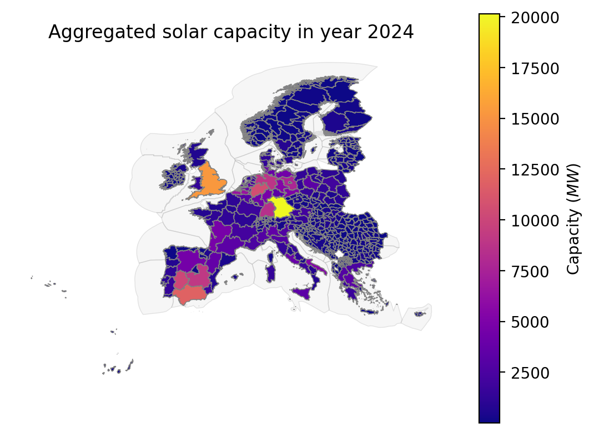
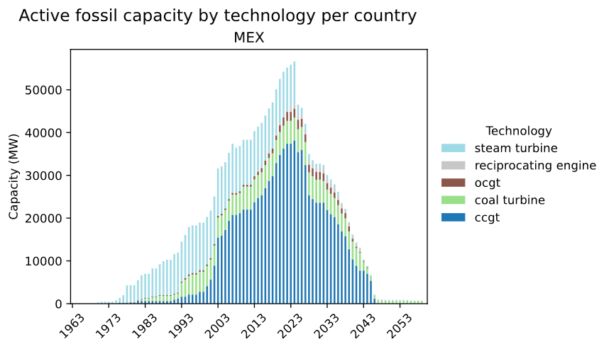
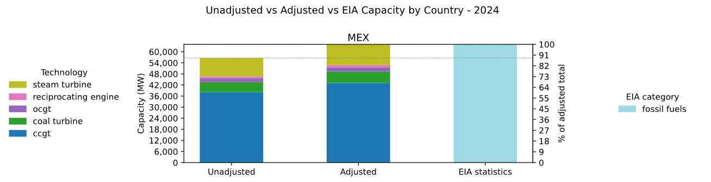
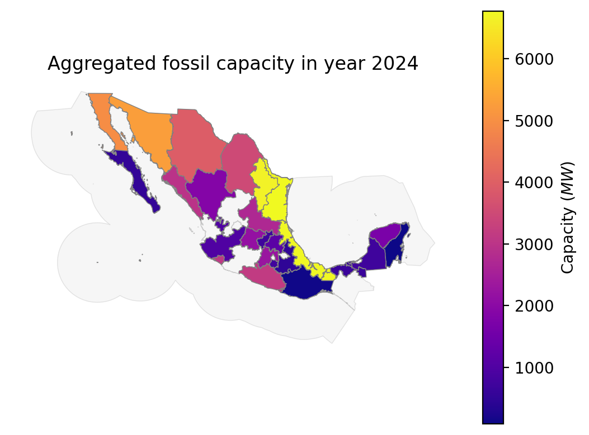

# Powerplants

A data module to estimate global powerplant capacities for any region in the world at any resolution.

<!-- Place an attractive image of module outputs here -->
<p align="center">
  
</p>


## About
<!-- Please do not modify this templated section -->

This is a modular `snakemake` workflow created as part of the [Modelblocks project](https://www.modelblocks.org/). It can be imported directly into any `snakemake` workflow.

For more information, please consult the Modelblocks [documentation](https://modelblocks.readthedocs.io/en/latest/),
the [integration example](./tests/integration/Snakefile),
and the `snakemake` [documentation](https://snakemake.readthedocs.io/en/stable/snakefiles/modularization.html).

## Overview
<!-- Please describe the processing stages of this module here -->

Data processing steps:

<p align="center">
  
</p>

1. Stable version-controlled global datasets are downloaded, including:
    - Disaggregated powerplant statistics from [GEM](https://globalenergymonitor.org/), [Transition-Zero](https://www.transitionzero.org/products/solar-asset-mapper), and [GloHydroRES](https://zenodo.org/records/14526360).
    - National-level statistics from the [EIA](https://www.eia.gov/).
2. Individual powerplants are prepared into point-source categories: bioenergy, fossil, geothermal, hydropower, nuclear, large_solar, and wind.
    - Fuel-burning powerplants (fossil, bioenergy) are assigned unique fuel-classes depending on the combination of fuels they utilise.
    - For utility-scale solar projects, satellite detected [TZ-Solar Asset Mapper](https://www.transitionzero.org/products/solar-asset-mapper) facilities are matched to [GEM-Global Solar Power Tracker](https://globalenergymonitor.org/) data to obtain a highly complete dataset of large-scale solar facilities.
3. Powerplants are selected according to the shapes file provided by the user. Depending on the configuration, their placement may be adjusted per technology and country.

<p align="center">
  
</p>

4. Powerplant start and end dates are imputed per category/technology using the configuration.
    - `lifetime_years` determines overall technology lifetime.
    - `retirement_delay_years` determines the remaining years of powerplants currently operating beyond their expected lifetime.

<p align="center">
  
</p>

> [!NOTE]
> Powerplant start/end dates are only imputed if they are not provided in the original dataset.

5. Optionally, powerplant capacities are adjusted evenly per category and country to match EIA statistics.


<p align="center">
  
</p>

> [!IMPORTANT]
> This stage may significantly inflate/deflate individual powerplants.
> We encourage users to carefully assess if this adjustment is merited by their use-case.

6. Powerplant capacity is aggregated to the provided shapes, for either adjusted or unadjusted powerplants.

<p align="center">
  
</p>

7. Solar is processed as a special case because rooftop PV panels are not covered in GEM or Transition-Zero data.
    1. Per country: $solar_{rooftopPV} = solar_{nationalStatistics} - solar_{largeScale}$.
    2. A user-provided proxy raster is used to determine how to disaggregate $solar_{rooftopPV}$.
    3. This proxy is used to determine the aggregated rooftop PV capacity per-shape.
    4. The final aggregated `solar` output combines `large_solar` facilities with proxied rooftop PV capacity.

<p align="center">
  
</p>

> [!NOTE]
> Due to this assumption, the lifetime of rooftop PV capacity is left undetermined.

### Important assumptions

- The current reference year for operating capacity, national statistics adjustment, and status imputation is `2024`.
- User-provided shapes should add up to whole countries. This is required for national statistics and rooftop PV proxying to remain meaningful.
- Adjusted outputs rescale operating powerplants to match EIA national category totals. Future and retired plants are kept unchanged.
- `large_solar` is available as a point-source category for utility PV and CSP. `solar` is only available for aggregated outputs because rooftop PV is represented through a proxy raster rather than individual plant points.


## Configuration
<!-- Please describe how to configure this module below -->

Please consult the configuration [README](./config/README.md) and the [configuration example](./config/config.yaml) for a general overview on the configuration options of this module.

## Input / output structure
<!-- Please describe input / output file placement below -->

Required user inputs:

- `<shapes>`: GeoParquet file with the target regional disaggregation. It must contain `shape_id`, `country_id` (ISO-3), `shape_class` (`land` or `maritime`), and valid polygon geometry.
- `<proxy_rooftop_pv>`: GeoTIFF proxy raster to use for adjusted aggregated `solar` outputs.

Optional user inputs:

- `<imputed_powerplants>`: category-specific GeoParquet files with additional point-source powerplants. These can add missing facilities or replace source records when combined with the `excluded_ids` configuration value.
- `<wemi>`: Wind Energy Market Intelligence `.xls` file, required only when `category.wind.source` is set to `wemi`.

Main outputs:

- `<powerplants>`: disaggregated point-source powerplants. `unadjusted` outputs are available for `bioenergy`, `fossil`, `geothermal`, `hydropower`, `nuclear`, `large_solar`, and `wind`; `adjusted` outputs are available for the same categories except `large_solar`.
- `<aggregated_capacity>`: capacity aggregated to the user-provided shapes. `bioenergy`, `fossil`, `geothermal`, `hydropower`, `nuclear`, and `wind` are available as `adjusted` or `unadjusted`; `large_solar` is available as `unadjusted`; `solar` is available as `adjusted`.

Please consult the [interface file](./INTERFACE.yaml) for exact path variables and wildcards.

## Development
<!-- Please do not modify this templated section -->

We use [`pixi`](https://pixi.sh/) as our package manager for development.
Once installed, run the following to clone this repository and install all dependencies.

```shell
git clone git@github.com:modelblocks-org/module_powerplants.git
cd module_powerplants
pixi install --all
```

Please be aware that this is a multi-environment project (see [pixi.toml](./pixi.toml) for details).
- `default`: used for development and integration testing.
Because it contains `Snakemake`, `conda` and `pytest` as dependencies it **should not be used** in `Snakemake` rules.
- `module`: contains minimal dependencies used in `Snakemake` rules.
If modified, be sure to export it to `Snakemake` so it can be recreated by module users:

```shell
# create module.yaml and conda-spec pin files in workflow/envs/
pixi run export-snakemake-env module
```


## Testing
<!-- Please do not modify this templated section -->

For testing, simply run:

```shell
pixi run test-integration
```

To test a minimal example of a workflow using this module:

```shell
pixi shell    # activate this project's environment
cd tests/integration/  # navigate to the integration example
snakemake --use-conda --cores 2  # run the workflow!
```

## References
<!-- Please provide thorough referencing below -->

This module is based on the following research and datasets:
For specific versions please consult our [stable dataset repository](https://doi.org/10.5281/zenodo.16037139).

* **Global Energy Monitor datasets.** <https://globalenergymonitor.org/>. License: CC BY 4.0.
    - Global Bioenergy Power Tracker
    - Global Coal Plant Tracker
    - Global Geothermal Power Tracker
    - Global Nuclear Power Tracker
    - Global Oil and Gas Plant Tracker
    - Global Solar Power Tracker
    - Global Wind Power Tracker
* **Global Hydropower powerplants.**
Shah, J., Hu, J., Edelenbosch, O., & van Vliet, M. T. H. (2024). GloHydroRes - a global dataset combining open-source hydropower plant and reservoir data [Data set]. Zenodo. <https://doi.org/10.5281/zenodo.14526360>. License: CC BY 4.0.
* **National capacity dataset.**
U.S. Energy Information Administration (Oct 2008). <https://www.eia.gov/international/overview/world>. License: Public domain.
* **Satellite Utility-scale PV dataset.**
TransitionZero Solar Asset Mapper, TransitionZero. <https://www.transitionzero.org/products/solar-asset-mapper>.
License: CC BY-NC 4.0.


## Contributors ✨

Thanks goes to these wonderful people, sorted alphabetically ([emoji key](https://allcontributors.org/en/reference/emoji-key/)):

<!-- ALL-CONTRIBUTORS-LIST:START - Do not remove or modify this section -->
<!-- prettier-ignore-start -->
<!-- markdownlint-disable -->
<table>
  <tbody>
    <tr>
      <td align="center" valign="top" width="14.28%"><a href="http://www.flombardi.org"><br /><sub><b>Francesco Lombardi</b></sub></a><br /><a href="#mentoring-FLomb" title="Mentoring">🧑‍🏫</a></td>
      <td align="center" valign="top" width="14.28%"><a href="https://github.com/FraSanvit"><br /><sub><b>Francesco Sanvito</b></sub></a><br /><a href="https://github.com/modelblocks-org/module_powerplants/commits?author=FraSanvit" title="Code">💻</a></td>
      <td align="center" valign="top" width="14.28%"><a href="https://orcid.org/0000-0003-2288-6423"><br /><sub><b>Ivan Ruiz Manuel</b></sub></a><br /><a href="#ideas-irm-codebase" title="Ideas, Planning, & Feedback">🤔</a> <a href="https://github.com/modelblocks-org/module_powerplants/commits?author=irm-codebase" title="Code">💻</a> <a href="https://github.com/modelblocks-org/module_powerplants/commits?author=irm-codebase" title="Documentation">📖</a> <a href="#maintenance-irm-codebase" title="Maintenance">🚧</a></td>
      <td align="center" valign="top" width="14.28%"><a href="http://www.pfenninger.org"><br /><sub><b>Stefan Pfenninger-Lee</b></sub></a><br /><a href="https://github.com/modelblocks-org/module_powerplants/pulls?q=is%3Apr+reviewed-by%3Asjpfenninger" title="Reviewed Pull Requests">👀</a> <a href="#projectManagement-sjpfenninger" title="Project Management">📆</a></td>
    </tr>
  </tbody>
</table>

<!-- markdownlint-restore -->
<!-- prettier-ignore-end -->

<!-- ALL-CONTRIBUTORS-LIST:END -->

This project follows the [all-contributors](https://github.com/all-contributors/all-contributors) specification. Contributions of any kind welcome!
